# T1A3 - Terminal Application

## Text Manipulation Application

### Kiran Warren

&nbsp;

## Contents

- [1 Github Link](./README.md#1-github-link)
- [2 Youtube Video Link](./README.md#2-youtube-video-link)
- [3 Code Styling Convention](./README.md#3-code-styling-convention)
- [4 Application Features](./README.md#4-application-features)
  - [4.1 Replace Word Function](./README.md#41-replace-word-function)
    - [4.1.1 Example of Replace Function Output](./README.md#411-example-of-replace-function-output)
  - [4.2 Double Space Function](./README.md#42-double-space-function)
    - [4.2.1 Example of Double Space Function Output](./README.md#421-example-of-double-space-function-output)
  - [4.3 Encrypt Text File](./README.md#43-encrypt-text-file)
    - [4.3.1 Example of Encrypt File Output](./README.md#431-example-of-encrypt-file-output)
  - [4.4 Decrypt Text File](./README.md#44-decrypt-text-file)
    - [4.4.1 Example of Decrypt File Output](./README.md#441-example-of-decrypt-file-output)
  - [4.5 Word/Character Count](./README.md#45-wordcharacter-count)
    - [4.5.1 Example of Word/Character Count Output](./README.md#451-example-of-wordcharacter-count-output)
  - [4.6 Top Occurring Words](./README.md#46-top-occurring-words)
    - [4.6.1 Example of Top Word Occurrences Output](./README.md#461-example-of-top-word-occurrences-output)
  - [4.7 Occurrence of Specified Word](./README.md#47-occurrence-of-specified-word)
    - [4.7.1 Example of Replace Function Output](./README.md#471-example-of-word-occurrence-output)
  - [4.8 Code Structure](./README.md#48-code-structure)
- [5 Implementation Plan](./README.md#5-implementation-plan)
- [6 Help Documentation](./README.md#6-help-documentation)
  - [6.1 Requirements](./readme#61-requirements)
    - [6.1.1 Recommended Operating System](./readme#611-recommended-operating-system)
    - [6.1.2 Hardware Requirements](./README.md#612-hardware-requirements)
    - [6.1.3 Required Software](./README.md#613-required-software)
    - [6.1.4 Software Dependencies](./README.md#614-software-dependencies)
  - [6.2 How to Install Application](./README.md#62-how-to-install-application)
  - [6.3 How to Run Application](./README.md#63-how-to-run-application)
  - [6.4 How to Use Application](./README.md#64-how-to-use-application)
    - [6.4.1 General](./README.md#641-general)
    - [6.4.2 Main Menu](./README.md#642-main-menu)
    - [6.4.3 Replace Function](./README.md#643-replace-function)
    - [6.4.4 Double Space Function](./README.md#644-double-space-function)
    - [6.4.5 Encrypt Text File](./README.md#645-encrypt-text-file)
    - [6.4.6 Decrypt Text File](./README.md#646-decrypt-text-file)
    - [6.4.7 Word/Character Count](./README.md#647-wordcharacter-count)
    - [6.4.8 Top Word Occurrences](./README.md#648-top-word-occurrences)
    - [6.4.9 Word Occurrence](./README.md#649-word-occurrence)
    - [6.4.10 Exiting the Application](/README.md#6410-exiting-the-application)
- [References](/README.md#references)

## 1 Github Link

[Github Repository Link for T1A3](https://github.com/KiranWarren/KiranWarren_T1A3)

## 2 Youtube Video Link

[YouTube Video Link for T1A3](https://youtu.be/iP7aFJyvFbo)

## 3 Code Styling Convention

The styling convention used for all code is the PEP 8 style guide. This style guide is created and managed by Python.org, and provides an extensive number of guidelines to maximise code readability.

To implement this style guide, the autopep8 module was utilised. Autopep8 can be installed using pip install. To apply the auto-formatter to a python file, the following command was entered into the terminal:

> autopep8 --in-place -a -a filename.py

The 'in-place' argument will format the code instead of outputting a formatted version of the code in the console. The two 'a' arguments increase the aggressiveness of the auto-formatter.

## 4 Application Features

The Text File Manipulation Application provides some manipulation and analysis of text files (.txt). The application will read the contents of a specified .txt file within the "inputs" folder, perform some analysis or manipulation on the content, then provide the user output in the form of (a) printing output within the console or (b) write the manipulated contents to a new file created in the 'outputs' folder. There are seven separate functions that are provided in this application, each one described in more detail under the subheadings below.

### 4.1 Replace Word Function

The replace function is a manipulation-type function that will replace all occurrences of a user-specified word within a text file with a replacement word. The function will output an altered version of the text file to the 'outputs' folder and the original file will not be altered. It may be useful if a particular word has been misspelt throughout a text file, or a word may have been incorrectly used throughout a text file, or a name may need to be changed.

The user will be requested to give four inputs:

- Specify the text file within the 'inputs' folder that they would like to work with.
- Enter the word that they would like to replace.
- Enter the word they they would like to use as a replacement.
- Enter the new file name for the output text file.

This function works by reading the contents of the imported text file and breaking up the long string of contents into a list of substrings. It will create a copy of this substring list, albeit, stripped of punctuation and forced lowercase. The word the user has chosen to replace can then be matched within the stripped substring list and all indices at matching locations are recorded. The string replace method is used on the original substring list (using replace word and replacement word as arguments) at all matching index locations. Finally, the substring list is built back into a single output string and written to a new file.

The replace function was re-written a few times due to issues encountered along the way. Both letter case and punctuation provide difficulties when trying to match a string to a list of broken up prose. Some examples of the issues encountered along the way include:

- The string replace method cannot be used on the initial output. If we wanted to replace "cat" with "dog", we could end up with unexpected words within the text such as "dogerpillar".
- Possible punctutation permutations are too many to account for. Originally, the function tried to create a list of possible punctuation variations (e.g. 'cat.', 'cat?', 'Cat!', etc.), however, testing proved that a matching list would have been both massive and ineffective. Punctuation (and case) needed to be ignored to effectively match words.
- For grammatically correct prose, there was still one special case that wasn't being accounted for: '/'. The code was reading "cat/dog" as a single word, and the word match was not working. As a fix, the string replace method was used on the input string to replace "/" with " / " in order to space out the words. On the other end, the opposite operation was perform to remove the extra spaces.

#### 4.1.1 Example of Replace Function Output

Input text in text file:

User input into console:

> What word would you like replaced? everyone  
> What word would you like to replace 'everyone' with? world

Output text in created text file:

### 4.2 Double Space Function

The double space function is a manipulation-type function that will double-space content of a text file. The altered content is written to a new text file and saved to the 'outputs' folder, and the original file is not altered in any way. This may be useful if someone prefers double-spaced prose and wants a quick solution instead of manually adding a space between words.

The user will be requested to give two inputs:

- Specify the text file within the 'inputs' folder that they would like to work with.
- Enter the new file name for the output text file.

The double space function works by breaking up the input string into a list of substrings. The substring list can then be built back into an output string with two spaces as the delimiter. This functionality was written as a helper function for the replace word function, so it was easy to implement for another use.

#### 4.2.1 Example of Double Space Function Output

Input text in text file:

Output text in created text file:

### 4.3 Encrypt Text File

The encrypt file function is a manipulation-type function that will symmetrically encrypt a text file using a password the user enters as the basis for the key. The encrypted content is written to a new text file in the 'outputs' folder, and the original text file is not altered in any way. This has a multitude of possible uses, and provides some privacy/protection on the contents of the text file. A nefarious third party would require the encrypted text file, the user's secret password, and this text manipulation application in order to decrypt the contents in a reasonable timeframe.

The user will be requested to give three inputs:

- Specify the text file within the 'inputs' folder that they would like to work with.
- Enter a password that will be used to encrypt the file. This same password is then required in another function to decrypt the encrypted text file.
- Enter the new file name for the output text file.

The encryption function utilises the cryptography.fernet module, installed to the virtual environment via pip. This module encrypts (or decrypts) bytes data passed using a 32-byte base64-encoded "key". This module comes with a key generator that will create a random key, however, for simplicity of use, this was not utilised. It was preferred for the user to memorise a password they specify instead of memorising a string of 32 random characters or having to manage an extra file containing the key.

The key is created using the password the user enters as a basis. The password must be between 1 and 32 characters, and contain only ascii letters and digits. There are helper functions nested within a while loop to ensure that the function does not proceed until a valid password is given by the user. This password is then padded out to 32 characters (if required), and base64 encoded using the base64 module.

#### 4.3.1 Example of Encrypt File Output

Input text in text file:

Password entered by user:

> This txt file will be symmetrically encrypted with a password of your choosing.  
> Please record your password somewhere safe, as you will need it to decrypt your file.  
> Enter a password consisting of letters and digits (a-z A-Z 0-9), and is 1 to 32 characters in length.  
> Password: <b>Secret</b>

Output text in text file:

### 4.4 Decrypt Text File

The decrypt file function in a manipulation-type function that will decrypt a file that was encrypted by the encryption function.

The user will be requested to give three inputs:

- Specify the text file within the 'inputs' folder that they would like to work with.
- Enter the password that was used to encrypt the file.
- Enter the new file name for the output text file.

The decryption function works in the opposite order of the encryption function.

#### 4.4.1 Example of Decrypt File Output

Input text in the text file:

Correct password entered by user:

> Please enter your password that you used to encrypt this file: <b>Secret</b>

_Note: If the wrong password is entered for an encrypted file, the application will alert the user and return them to the main menu._

Output text in the created text file:

### 4.5 Word/Character Count

The word/character count function is an analysis-type function. The output is given in the console, and no files are created or altered. It may be useful for a user wanting to know how many words are within a text file. It also provides character counts, both without spaces and with spaces included.

The user will be requested to give one input:

- Specify the text file within the 'inputs' folder that they would like to work with.

This function works by reading the content from the specified file and breaking it up into a list of substrings. The word count is given by the length of the substring list. Total character count is given by the length of the input string. The total character count excluding spaces is given by the summation of all substrings minus newlines.

#### 4.5.1 Example of word/character Count Output

Input text in text file:

Output in console:

> Your text file has been analysed. The results are below.  
> Word Count: 9  
> Character Count (excluding spaces): 43  
> Character Count (including spaces): 49

### 4.6 Top Occurring Words

The top occurring words function is an analysis-type function. The output is given in the console, and no files are created or altered. It may be useful for a user to find the highest used words within a given text file. The user is given the option to view the top 1, top 3 or top 10 highest used words.

The user will be requested to give two inputs:

- Specify the text file within the 'inputs' folder that they would like to work with.
- Select whether they would like to see the top 1, top 3 or top 10 most frequently used words.

This function works by reading the content of the specified file and splitting it up into a list of substrings using the split method with the default delimiter. Punctuation must be removed and letter case must be forced lower in order for the matching algorithm to effectively match. Each word from the substring list is added to a dictionary with value = 1, and if it already exists, then the value is increased by one.
The top occurring words can then be found by finding the max value in a dictionary for however many times the user has specified. In order to use the max function repeatedly, the highest key:value pair must be removed from the dictionary after it is printed to the console. This allows the next highest value to become the dictionary's max value.

#### 4.6.1 Example of Top Word Occurrences Output

Input text in text file:

Output in the console, with the user choosing option 1 (top 1 word occurrence):

> The top 1 word occurrences are:   > [1] hello - 2

### 4.7 Occurrence of Specified Word

The word occurrences function is an analysis-type function. The output is given in the console, and no files are created or altered. It may be useful for a user to see how many times a certain word is used within a given text file.

The user will be requested to give two inputs:

- Specify the text file within the 'inputs' folder that they would like to work with.
- Enter the word that they would like analyse the frequency of use.

This function uses the same logic as the top occurring words function, however, instead of printing the max value(s) from the dictionary, only the value for the key specified by the user will be displayed.

#### 4.7.1 Example of Word Occurrence Output

Input text in text file:

User input into the console, specifying what word to count:

> What word would you like to check the occurrences of? <b>dinner</b>

Output in the console, with the user choosing option 1 (top 1 word occurrence):

> The word "dinner" occurs 1 time(s) in the txt file.

### 4.8 Code Structure

The code consists of the following files and their functions defined within:

- clear_terminal.py
  - clear_terminal() - This function clears all text from the terminal window.
- double_space_function.py
  - double_space() - Double spaces plain text file contents.
- encryption_functions.py
  - check_password_empty(password) - This function checks if a user entered a blank password.
  - check_password_valid(password) - This function checks if a user used invalid characters for their password.
  - check_password_length(password) - This function checks if a user entered a password longer than 32 characters.
  - password_check(password) - This function (with the use of the smaller check password functions) ensures that the password the user gives is valid. It will also pad the password to 32 characters and encode it.
  - encrypt() - This function encrypts the contents of a plain text file with Fernet symmetrical encryption.
  - decryrpt() - This function will decrypt a plain text file that has been encrypted by the encrypt() function.
- export_file.py
  - export_file(output_string, new_file_name) - This function will write the output contents to a new file created in the 'outputs' folder.
  - convert_list_to_string(substring_list, delimiter) - This function will create an output string from a list of substrings. Default delimiter is a single space.
- import_file.py
  - import_file() - This function will give the user a list of plain text files that are within the 'inputs' folder. The chosen file will have its contents read and saved to a string that will be returned.
  - convert_string_to_list(input_string) - This function will convert an imported string into a list of substrings.
- main_menu.py
  - main_menu() - Provides the user a list of the applications functions.
- main.py - This is the backbone of the application that will call other functions based on user input.
- occurrence_function.py
  - This function will determine the number of times a user-specified word occurs within a plain text file.
- replace_function.py
  - strip_punctuation(substring_list) - This function will remove punctuation from a list of substrings. It will also force all uppercase letters to lowercase.
  - replace() - This function will replace all instances of a user-specified word with another word.
- top_occurrences_function.py
  - top_occurrences() - This function determines the most frequently used words within a plain text file.
- word_count_function.py
  - word_count() - This function determines the number of words and characters within a plain text file.

## 5 Implementation Plan

Trello was used to assist with the implementation plan of this project.

Before coding, the broad list of tasks were created as lists, each with a self-imposed due date to help keep the project on track. Within each list, discrete sections or ideas were given individual cards. This helped track ideas that could be posted as comments, estimated time to complete a task using labels, and complete/cancelled status of cards using the green/red labels.

The tasks were tackled left-to-right, top-to-bottom. This gave tasks on the left a higher priority and would logically be tackled first. Some of the helper functions used within several functions were created first, which helped keep development smooth. Some of the additional parts of this assignment are also tracked here just for convenience.

A link to the implementation plan can be found here: [Trello link for T1A3](https://trello.com/b/kYs3dbDa/kiranwarrent1a3).

## 6 Help Documentation

### 6.1 Requirements

#### 6.1.1 Recommended Operating System

- Windows 10 or newer, using Windows Subsystem for Linux (WSL)
- MAC OS 11 or newer
- Linux Ubuntu

#### 6.1.2 Hardware Requirements

- Desktop or laptop PC
- Recommended <5 years old
- Internet connection is required

#### 6.1.3 Required Software

- Terminal with bash shell
- Python 3.9 or later (latest version recommended)
- pip 20 or later (installed with Python 3 by default)

#### 6.1.4 Software Dependencies

- Python module: os
- Python module: platform
- Python module: base64
- Python module: string
- Python module: cryptography (pip install required, handled by application)
- Python module: pytest (pip install required, handled by application)

### 6.2 How to Install Application

1. Download .zip file 'KiranWarren_T1A3.zip'.
2. Unzip the contents of 'KiranWarren_T1A3.zip' to a directory of your choosing.

### 6.3 How to Run Application

1. Open a bash terminal session.
2. Change your working directory to the '/src' folder within '/KiranWarren_T1A3'. For example:

> /Users/kiran/Documents/Projects/KiranWarren_T1A3/src

3. Run the 'text_app.sh' script using the bash command. For example:

> bash text_app.sh

4. The text manipulation application should run within your terminal session.

(Optional Troubleshooting) Running the script with the explicit bash command should circumvent file permissions. However, if you receive a permission error when trying to run the script, try running the following command to change this script's permissions to executable before retrying step 3:

> chmod -x text_app.sh

### 6.4 How to Use Application

#### 6.4.1 General

Functions within this application must be used in conjunction with your .txt files. Before running the application, ensure that the text files you want to manipulate/analyse are stored in the 'inputs' folder in the src directory, i.e.:

> .../KiranWarren_T1A3/src/inputs

When new .txt files are created, they will be created within the outputs folder within the src directory:

> .../KiranWarren_T1A3/src/outputs

The output will automatically overwrite any files in the output folder with the same name, please keep this in mind when inputting new file names.

The functions of this application were designed to be used on prose (i.e. grammatically correct sentences & paragraphs). Manipulating irregular file contents may produce unusual results.

#### 6.4.2 Main Menu

1. The main menu provides all available functions. To use one of these functions, input the corresponding option number into the terminal and press enter. Inputting anything else will exit the application.

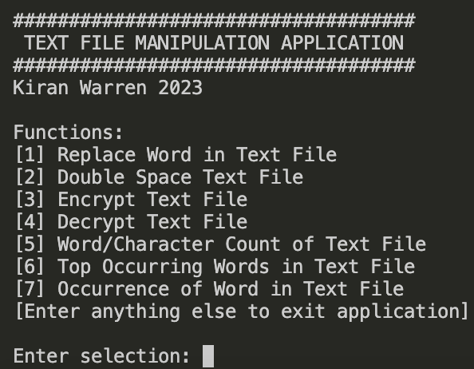

#### 6.4.3 Replace Function

The replace function is used to replace all instances of a specified word within a text file with another word of your choosing. A new text file will be created with your output in the 'outputs' folder with the new file name of your choosing.

1. Enter '1' and press enter on the main menu to enter the replace function.
2. Choose the text file you want to import by inputting the corresponding option number into the terminal and pressing enter. To return to the main menu, enter anything else.

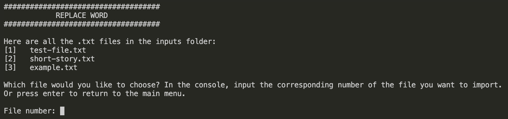

3. Input the word you want to replace and press enter.

4. Input the word you want to use as a replacement and press enter.

5. Specify your new file name and press enter. Do not include the file extension as this will be handled by the application.

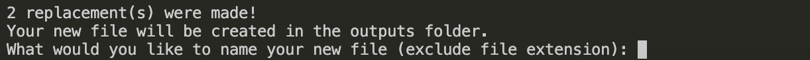

6. Your new text file will be created in the 'outputs' folder.

#### 6.4.4 Double Space Function

The double space function will place two spaces between words in your .txt file. A new text file will be created with your output in the 'outputs' folder with the new file name of your choosing.

1. Enter '2' and press enter on the main menu to enter the double space function.
2. Choose the text file you want to import by inputting the corresponding option number into the terminal and pressing enter. To return to the main menu, enter anything else.

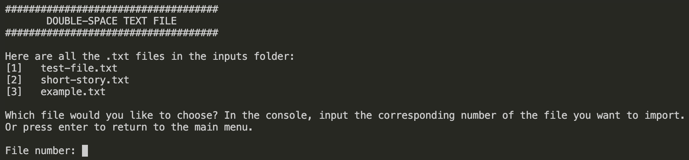

3. Specify your new file name and press enter. Do not include the file extension as this will be handled by the application.

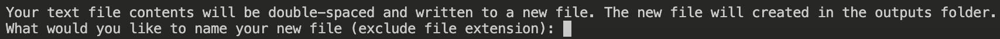

4. Your new text file will be created in the 'outputs' folder.

#### 6.4.5 Encrypt Text File

The encrypt text file function will encrypt the contents of your .txt file. A new (encrypted) text file will be created with your output in the 'outputs' folder with the new file name of your choosing.

1. Enter '3' and press enter on the main menu to enter the encrypt text file function.
2. Choose the text file you want to import by inputting the corresponding option number into the terminal and pressing enter. To return to the main menu, enter anything else.

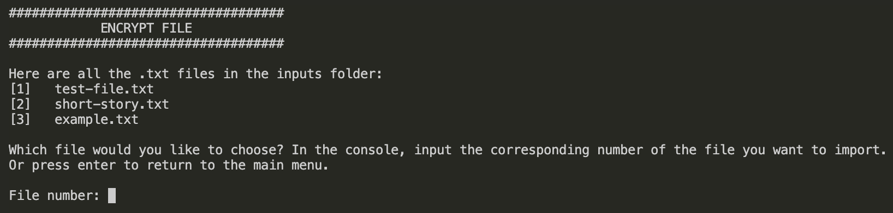

3. Input the password you want to lock this encrypted file with and press enter. The password you enter must consist of uppercase letters, lowercase letters or numbers only (i.e. A-Z, a-z, 0-9). If you enter an invalid password, you will be requested again to input a valid password. Important: Please record your password somewhere private! This password is required to decrypt the encrypted .txt file.

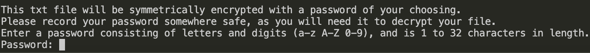

4. Specify your new file name and press enter. Do not include the file extension as this will be handled by the application.

5. Your new text file will be created in the 'outputs' folder. Keep in my that the original, unencrypted .txt file will still exist in the 'inputs' folder.

#### 6.4.6 Decrypt Text File

The decrypt text file function will decrypt any files that were encrypted by the encrypt text file function. You must use the same password that was used to lock the file. A new (decrypted) text file will be created with your output in the 'outputs' folder with the new file name of your choosing.

1. Enter '4' and press enter on the main menu to enter the decrypt text file function.
2. Choose the text file you want to import by inputting the corresponding option number into the terminal and pressing enter. To return to the main menu, enter anything else.

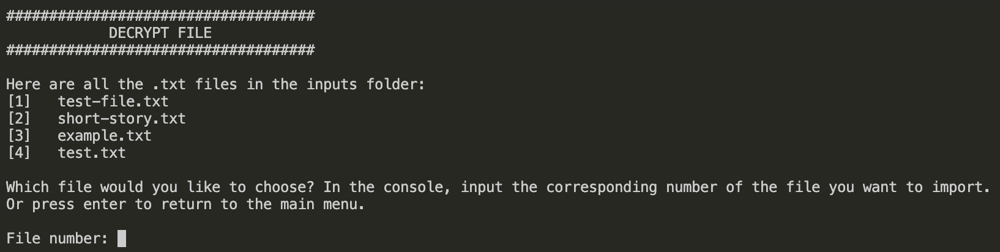

3. Input the password that was used to encrypt this file.

4. Specify your new file name and press enter. Do not include the file extension as this will be handled by the application.

5. Your new text file will be created in the 'outputs' folder.

#### 6.4.7 Word/Character Count

The word and character count function will determine how many words and characters (including and excluding spaces) are in the .txt file you specify. The results will be printed to the terminal.

1. Enter '5' and press enter on the main menu to enter the word/character count function.
2. Choose the text file you want to import by inputting the corresponding option number into the terminal and pressing enter. To return to the main menu, enter anything else.

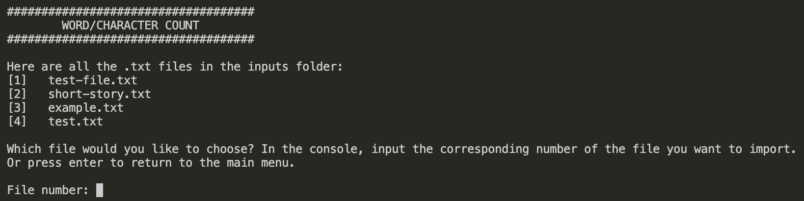

3. Results will be shown in the terminal, e.g.:

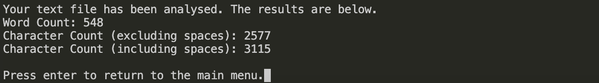

#### 6.4.8 Top Word Occurrences

The top word occurrences function will find the most frequently used words within a .txt file you specify. You have the option to see the top 1, top 3 or top 10 most frequently used words. The results will be printed to the terminal.

1. Enter '6' and press enter on the main menu to enter the top word occurrences function.
2. Choose the text file you want to import by inputting the corresponding option number into the terminal and pressing enter. To return to the main menu, enter anything else.

3. Choose the number of most frequently occurring words you would like to see. Input the corresponding number into the terminal and press enter.

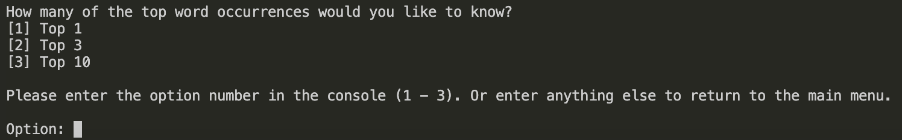

4. Results will be shown in the terminal, e.g.:

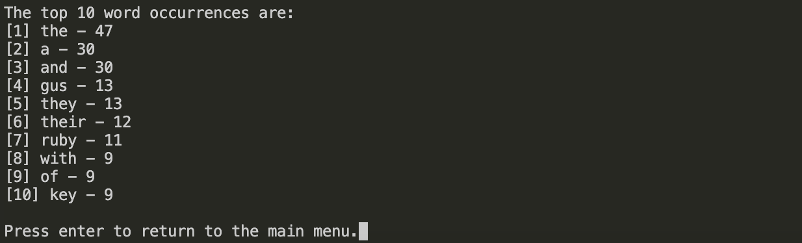

#### 6.4.9 Word Occurrence

The word occurrence function will determine how many times a word of your choosing occurs within a specified .txt file. The results will be printed to the terminal.

1. Enter '7' and press enter on the main menu to enter the word occurrence function.
2. Choose the text file you want to import by inputting the corresponding option number into the terminal and pressing enter. To return to the main menu, enter anything else.

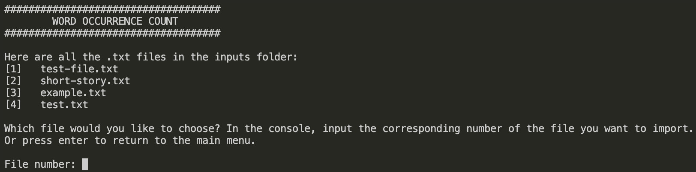

3. Input the word you would like analysed and press enter:

4. Result will be shown in the terminal, e.g.:

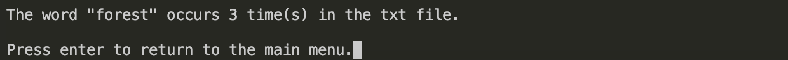

#### 6.4.10 Exiting the Application

1. To exit the application, press enter in the terminal while in the main menu (without any other input).

## References

- "Python Read Text File", **Python Tutorial**, accessed 27 June 2023, <<https://www.pythontutorial.net/python-basics/python-read-text-file>>.
- "Python List Files in a Directory", **PYnative**, accessed 27 June 2023, <<https://www.pynative.com/python-list-files-in-a-directory>>.
- "PEP 8 - Style Guide for Python Code", **Python**, accessed 27 June 2023, <<https://peps.python.org/pep-0008>>.
- "Welcome to pyca/cryptography", **Cryptography.io**, accessed 30 June 2023, <<https://cryptography.io/en/latest>>.
- "Text File Image", **Freepik**, **Flaticon**, <<https://www.flaticon.com/free-icon/txt-file_3979306?term=txt+file&page=1&position=18&origin=search&related_id=3979306>>.
- "Gears Image", **Bekris**, **Flaticon**, <<https://www.flaticon.com/free-icon/engineering_3079162?term=gears&page=1&position=11&origin=search&related_id=3079162>>.
- R. Wijaya, "Terminal Image", **Flaticon**, <<https://www.flaticon.com/free-icon/terminal_7560719?term=terminal&page=1&position=7&origin=search&related_id=7560719>>.
